# 项目架构文档

## 1. 系统架构概述

### 1.1 架构风格
本项目采用前后端分离的多层架构，面向软件工程研究者提供科研级数据分析能力。系统分为数据采集层、数据处理层、智能检索层、分析服务层和前端应用层。各层之间通过明确的接口进行通信，实现松耦合、高内聚的设计。

核心价值导向是服务于高校科研工作者，帮助摸清软件产业未来发展趋势，同时为开发者提供高效的自然语言代码检索能力。

### 1.2 核心架构图

```mermaid
flowchart TD
    subgraph 前端应用层
        A[Vue 3前端应用] --> B[数据可视化组件]
        A --> C[用户交互界面]
        A --> D[自然语言检索界面]
        B --> E[ECharts图表]
    end
    
    subgraph API服务层
        F[API网关] --> G[项目API]
        F --> H[统计API]
        F --> I[分析API]
        F --> J[检索API]
        F --> K[组织API]
    end
    
    subgraph 智能检索层
        L[自然语言检索服务] --> M[查询解析器]
        L --> N[语义匹配引擎]
        L --> O[结果排序器]
        L --> P[内核校验模块]
    end
    
    subgraph 科研分析层
        Q[趋势分析服务] --> R[编程语言趋势分析]
        Q --> S[变化幅度分析]
        Q --> T[趋势预测引擎]
        U[组织分析服务] --> V[活跃度分析]
        U --> W[技术深度评估]
        X[品类分析服务] --> Y[软件品类分类]
        X --> Z[占比分析]
        AA[价值评估服务] --> AB[长期价值评估]
        AA --> AC[优质代码识别]
    end
    
    subgraph 数据处理层
        AD[数据处理服务] --> AE[数据清洗]
        AD --> AF[数据转换]
        AD --> AG[质量评估]
    end
    
    subgraph 数据采集层
        AH[Scrapy爬虫] --> AI[GitHub API爬虫]
        AH --> AJ[网页爬虫]
        AK[任务调度器] --> AH
    end
    
    subgraph 数据存储层
        AL[MongoDB数据库] --> AM[项目集合]
        AL --> AN[所有者集合]
        AL --> AO[组织集合]
        AL --> AP[提交集合]
        AL --> AQ[贡献者集合]
        AL --> AR[分析结果集合]
        AL --> AS[检索记录集合]
    end
    
    A -- HTTP请求 --> F
    F -- 查询/分析 --> AL
    F -- 检索请求 --> L
    F -- 分析请求 --> Q
    F -- 分析请求 --> U
    F -- 分析请求 --> X
    F -- 分析请求 --> AA
    L -- 数据查询 --> AL
    L -- 结果校验 --> P
    Q -- 数据查询 --> AL
    Q -- 存储结果 --> AL
    U -- 数据查询 --> AL
    U -- 存储结果 --> AL
    X -- 数据查询 --> AL
    X -- 存储结果 --> AL
    AA -- 数据查询 --> AL
    AA -- 存储结果 --> AL
    AD -- 数据查询 --> AL
    AD -- 存储结果 --> AL
    AH -- 爬取数据 --> AD
    AK -- 定时任务 --> AH
```

### 1.3 架构特点
- **科研导向**：以服务软件工程研究者为核心目标，支持科研级数据分析
- **智能检索**：支持自然语言检索匹配，实现精准的代码和解决方案定位
- **趋势预测**：具备编程语言和技术栈的趋势预测能力
- **多维度分析**：支持编程语言趋势、组织活跃度、软件品类等多维度分析
- **内核校验**：具备大模型输出结果的校验和修正能力
- **可扩展性**：模块化设计，支持功能扩展和水平扩展

## 2. 模块详细设计

### 2.1 数据采集层

#### 2.1.1 Scrapy爬虫
- **功能**：负责从GitHub平台爬取项目数据和组织数据
- **组件**：
  - GitHub API爬虫：利用GitHub API获取项目基本信息、组织信息
  - 网页爬虫：处理API无法获取的详细信息，使用Selenium处理JavaScript渲染页面
- **技术实现**：
  - 使用Scrapy框架实现异步爬取
  - 利用Selenium处理JavaScript渲染的页面
  - 实现增量爬取逻辑，只爬取新增或更新的项目
  - 将爬取的数据直接传递到数据处理层

#### 2.1.2 任务调度器
- **功能**：负责调度和管理爬取任务
- **组件**：
  - 定时任务调度器
  - 任务队列管理
  - 任务执行监控
- **技术实现**：
  - 使用Quartz实现任务调度
  - 监控爬虫执行状态
  - 实现任务优先级和重试机制

### 2.2 数据处理层

#### 2.2.1 数据处理服务
- **功能**：处理爬取的原始数据，进行清洗、转换和质量评估
- **组件**：
  - 数据清洗模块：去除无效信息和重复数据
  - 数据转换模块：将数据转换为统一格式
  - 质量评估模块：对项目进行质量评分和长期价值评估
- **技术实现**：
  - 使用Python进行数据处理
  - 使用Pandas进行数据清洗和转换
  - 使用NumPy进行数值计算
  - 直接将处理结果存储到MongoDB

### 2.3 智能检索层（核心能力）

#### 2.3.1 自然语言检索服务
- **功能**：支持自然语言查询，实现精准的代码检索匹配
- **组件**：
  - 查询解析器：解析自然语言查询，提取核心意图和关键词
  - 意图识别器：识别用户查询意图（查找代码、分析趋势、寻找相似项目）
  - 语义匹配引擎：使用大模型将自然语言转换为查询条件，实现代码与自然语言的语义匹配
  - 结果排序器：按匹配度、质量评分、活跃度等多维度排序
- **技术实现**：
  - 使用LangChain框架构建检索链
  - 集成大模型API进行语义理解
  - 使用MongoDB全文索引进行相似性匹配

#### 2.3.2 内核校验模块
- **功能**：校验大模型输出结果的准确性
- **组件**：
  - 效果维度拆解：将核心效果维度拆解为可量化指标（准确率、召回率、精确率）
  - 基准测试：使用标准测试集评估大模型性能
  - 交叉核验：结合自有数据集对模型输出进行验证
  - 偏差修正：识别模型输出偏差并提供修正建议
- **技术实现**：
  - 建立测试数据集进行交叉验证
  - 实现结果反馈机制，持续优化模型效果

### 2.4 科研分析层

#### 2.4.1 趋势分析服务
- **功能**：分析编程语言发展趋势，预测未来流行趋势
- **组件**：
  - 编程语言趋势分析：分析各编程语言项目数量的增长趋势
  - 变化幅度分析：识别变化幅度最大的技术方向
  - 趋势预测引擎：使用时间序列分析预测未来编程语言的流行趋势
- **技术实现**：
  - 使用Pandas进行时间序列分析
  - 使用NumPy进行数值计算
  - 实现统计分析算法
  - 生成分析结果并存储到MongoDB

#### 2.4.2 组织分析服务
- **功能**：分析组织/机构的活跃度和技术应用深度
- **组件**：
  - 活跃度分析：基于提交频率、仓库更新、成员参与度计算组织活跃度
  - 技术深度评估：分析组织的技术栈多样性和深度
  - 技术栈分析：识别组织的主流技术栈选择
- **技术实现**：
  - 使用Pandas进行数据处理
  - 实现活跃度评分算法
  - 生成分析结果并存储到MongoDB

#### 2.4.3 品类分析服务
- **功能**：分析不同类型软件在GitHub生态中的分布
- **组件**：
  - 软件品类分类：将项目分类为移动软件、Web软件、桌面软件、工具类等
  - 占比分析：统计不同类型软件在GitHub生态中的占比
  - 使用率分析：分析各品类的使用率变化趋势
- **技术实现**：
  - 使用机器学习算法进行品类分类
  - 使用Pandas进行统计分析
  - 生成分析结果并存储到MongoDB

#### 2.4.4 价值评估服务
- **功能**：评估项目的长期价值和可持续性
- **组件**：
  - 长期价值评估：基于活跃度、社区健康度、维护状态评估项目长期价值
  - 优质代码识别：识别具有高参考价值的优质代码项目
  - 健康度分析：评估项目的健康度和可持续性
- **技术实现**：
  - 建立多维度评估指标体系
  - 使用加权算法计算综合评分
  - 生成评估结果并存储到MongoDB

### 2.5 API服务层

#### 2.5.1 API网关
- **功能**：统一管理和路由所有API请求
- **组件**：
  - 请求路由：将请求路由到对应的API服务
  - 负载均衡：实现请求负载均衡
  - 安全控制：实现API访问控制和限流
- **技术实现**：
  - 使用Spring Cloud Gateway实现API网关
  - 配置路由规则和限流策略

#### 2.5.2 项目API
- **功能**：提供项目相关的CRUD操作
- **组件**：
  - 项目查询：支持多条件筛选和排序
  - 项目详情：获取项目详细信息
  - 项目统计：获取项目统计数据
- **技术实现**：
  - 使用Spring Boot框架实现API服务
  - 直接从MongoDB获取数据

#### 2.5.3 组织API
- **功能**：提供组织信息查询和分析接口
- **组件**：
  - 组织查询：支持多条件筛选和排序
  - 组织详情：获取组织详细信息
  - 组织分析：获取组织活跃度和技术栈分析结果
- **技术实现**：
  - 使用Spring Boot框架实现API服务
  - 直接从MongoDB获取数据

#### 2.5.4 分析API
- **功能**：提供编程语言趋势、组织活跃度、软件品类等分析结果
- **组件**：
  - 趋势分析：获取编程语言趋势分析结果
  - 组织分析：获取组织活跃度分析结果
  - 品类分析：获取软件品类分析结果
  - 价值评估：获取项目价值评估结果
- **技术实现**：
  - 使用Spring Boot框架实现API服务
  - 调用科研分析层服务获取分析结果

#### 2.5.5 检索API
- **功能**：提供自然语言检索服务
- **组件**：
  - 自然语言检索：支持自然语言查询
  - 代码检索：支持代码片段检索
  - 相似项目检索：支持相似项目查找
- **技术实现**：
  - 使用Spring Boot框架实现API服务
  - 调用智能检索层服务获取检索结果

### 2.6 数据存储层

#### 2.6.1 MongoDB数据库
- **功能**：存储所有项目数据、组织数据、分析结果和检索记录
- **组件**：
  - 项目集合：存储项目基本信息，包括质量评分和长期价值评估
  - 所有者集合：存储项目所有者信息
  - 组织集合：存储组织信息，包括活跃度评分和技术应用深度
  - 提交集合：存储项目提交记录
  - 贡献者集合：存储项目贡献者信息
  - 分析结果集合：存储数据分析结果，包括准确率指标
  - 检索记录集合：存储检索查询记录和校验结果
- **技术实现**：
  - 使用MongoDB作为主要数据库
  - 设计合理的数据模型和索引
  - 实现数据备份和恢复策略
  - 使用TTL索引实现数据过期策略

### 2.7 前端应用层

#### 2.7.1 Vue 3前端应用
- **功能**：提供用户界面和交互
- **组件**：
  - 首页：项目概览、热门项目展示、技术趋势图表、快速检索入口
  - 项目列表页：展示项目列表，支持按语言、星级、活跃度筛选和排序
  - 项目详情页：展示项目详细信息、贡献者列表、提交历史、质量评估
  - 数据分析页：展示各类数据分析图表，支持多维度数据钻取
  - 趋势分析页：展示技术发展趋势，支持时间序列图表和预测曲线
  - 组织分析页：展示组织活跃度排名、技术栈分析、对比分析
  - 自然语言检索页：提供自然语言查询界面，支持代码检索和相似项目查找
- **技术实现**：
  - 使用Vue 3框架构建前端应用
  - 使用Pinia进行状态管理
  - 使用Element Plus提供UI组件
  - 使用ECharts实现数据可视化
  - 实现响应式设计，适配不同设备

## 3. 数据流设计

### 3.1 数据采集与处理流程
1. 任务调度器定时触发爬取任务
2. Scrapy爬虫从GitHub平台爬取项目数据和组织数据
3. 数据处理服务接收爬取的原始数据
4. 数据处理服务进行清洗、转换和质量评估
5. 处理后的数据直接存储到MongoDB

### 3.2 数据查询流程
1. 前端应用发送API请求
2. API网关接收请求并路由到对应的API服务
3. API服务直接从MongoDB获取数据
4. API服务将结果返回给前端应用

### 3.3 自然语言检索流程
1. 用户在前端应用输入自然语言查询
2. 检索API接收请求并转发给自然语言检索服务
3. 查询解析器解析查询，提取核心意图
4. 语义匹配引擎进行代码与自然语言的语义匹配
5. 结果排序器对结果进行多维度排序
6. 内核校验模块对结果进行准确性校验
7. 检索结果通过API服务返回给前端应用

### 3.4 科研分析流程
1. 前端应用发送分析请求
2. 分析API接收请求并转发给对应的分析服务
3. 分析服务从MongoDB获取原始数据
4. 分析服务进行深度分析计算（趋势分析、组织分析、品类分析、价值评估）
5. 分析结果存储到MongoDB
6. 分析结果通过API服务返回给前端应用
7. 前端应用使用ECharts展示分析结果

## 4. 部署架构

### 4.1 容器化部署
- **Docker容器**：
  - 爬虫容器：运行Scrapy爬虫
  - API网关容器：运行Spring Cloud Gateway
  - API服务容器：运行Spring Boot API服务
  - 数据处理容器：运行Python数据处理服务
  - 检索服务容器：运行自然语言检索服务
  - MongoDB容器：运行MongoDB数据库
  - 前端应用容器：运行Vue 3前端应用

### 4.2 容器编排
- **Docker Compose**：
  - 定义服务之间的依赖关系
  - 配置网络和存储
  - 实现一键部署和管理

### 4.3 监控与日志
- **Prometheus**：监控系统性能和资源使用情况
- **Grafana**：可视化监控数据
- **ELK Stack**：日志收集和分析

## 5. 扩展性设计

### 5.1 水平扩展
- **爬虫集群**：增加爬虫实例以提高爬取速度
- **API服务集群**：增加API服务实例以提高并发处理能力
- **检索服务集群**：增加检索服务实例以提高检索性能
- **MongoDB分片**：使用MongoDB分片技术扩展存储容量

### 5.2 垂直扩展
- **硬件升级**：增加服务器内存和CPU资源
- **数据库优化**：优化MongoDB配置，增加缓存大小

### 5.3 功能扩展
- **支持更多数据源**：扩展爬虫以支持其他代码托管平台
- **增加更多分析维度**：扩展数据分析模块以支持更多分析维度
- **集成更多大模型**：支持多种大模型接口，提高检索准确性
- **增加数据导出功能**：支持将分析结果导出为多种格式

## 6. 技术依赖关系

### 6.1 核心依赖
| 依赖项 | 版本 | 用途 | 来源 |
|-------|------|------|------|
| Java | 11+ | API服务开发 | https://www.oracle.com/java/ |
| Python | 3.8+ | 爬虫、数据分析、自然语言处理 | https://www.python.org/ |
| Scrapy | 2.6+ | 异步数据爬取 | https://scrapy.org/ |
| Selenium | 4.0+ | 网页自动化工具 | https://www.selenium.dev/ |
| MongoDB | 4.4+ | 主要数据库 | https://www.mongodb.com/ |
| Spring Boot | 2.5+ | API框架 | https://spring.io/projects/spring-boot |
| Spring Cloud Gateway | 3.1+ | API网关 | https://spring.io/projects/spring-cloud-gateway |
| Quartz | 2.3+ | 任务调度 | http://www.quartz-scheduler.org/ |
| LangChain | 0.1+ | 自然语言处理 | https://www.langchain.com/ |
| Vue | 3.0+ | 前端框架 | https://vuejs.org/ |
| ECharts | 5.0+ | 数据可视化库 | https://echarts.apache.org/ |

### 6.2 辅助依赖
| 依赖项 | 版本 | 用途 | 来源 |
|-------|------|------|------|
| Pandas | 1.3+ | 数据处理库 | https://pandas.pydata.org/ |
| NumPy | 1.21+ | 数值计算库 | https://numpy.org/ |
| Docker | 20.10+ | 容器化平台 | https://www.docker.com/ |
| Docker Compose | 1.29+ | 容器编排工具 | https://docs.docker.com/compose/ |
| Prometheus | 2.30+ | 监控系统 | https://prometheus.io/ |
| Grafana | 8.0+ | 可视化工具 | https://grafana.com/ |
